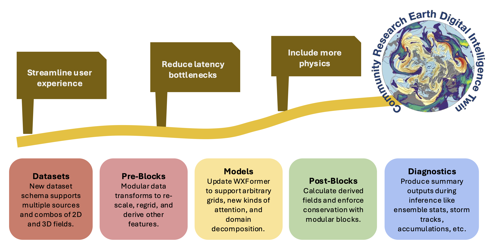

# CREDIT Gen 2 Overview

CREDIT Gen 2 addresses the need for an open, modular, composable framework to build ML Earth system prediction
models. CREDIT Gen 2 development has been guided by three key "signposts".

1. **Streamline user experience**: As a research tool, one of CREDIT's main goals is increasing speed to science.
We want users to be able to install the package and start running, training, and analyzing models within
minutes. We have added a CLI and restructured the config file to make interactions with CREDIT really straightforward.
2. **Reduce latency bottlenecks**: In our experience with CREDIT Gen 1, most of the compute time was being spent
loading data and performing pre- and post-processing operations. Therefore, we streamlined our datasets and converted
every pre-processing and post-processing step to PyTorch layers that can run on either CPU or GPU and are differentiable.
That means gradients can be calculated through physical transforms and time all the way to the initial conditions
in state space!
3. **Include more physics**: Even with the massive amount of data found in reanalyses and other model and observation 
datasets, many key processes and forcings are not explicitly represented, which results in the accumulation
of artifacts, oversmoothing, and improper coupling. We have made it much easier to include physics functions and
constraints at any point in the data and modeling pipeline. Not even the sky is the limit on what you could do with
this framework!

## Datasets
CREDIT Gen 2 has simplified the process for adding new Datasets and created
new Datasets for both local and cloud-based Datasets. We have also created
a new data schema that can support multiple data sources, 3D and 2D variables,
and a mix of prognostic, diagnostic, dynamic forcing, and static variables.

New Gen 2 Datasets include:
* **LocalDataset**: Supports any locally stored set of netCDF or Zarr files
with a regular directory structure and file format.
* **GOESDataset**: Supports cloud-based GOES 16, 17, 18, and 19 geostationary satellite
data stored on AWS.
* **ARCOERA5Dataset**: Provides direct cloud streaming from the Analysis-Ready Cloud-Optimized ERA5 dataset 
on Google Cloud.
* **WeatherBench2ERA5Dataset**: Direct cloud streaming from the WeatherBench2 ERA5 archive. Supports multiple resolutions.
* **HRRRDataset**: NOAA High-Resolution Rapid Refresh on AWS.
* **MRMSDataset**: NOAA Multi-Radar Multi-Sensor 3D radar mosaic over the US.

## Preblocks

## Models

## Postblocks

## Interfaces

