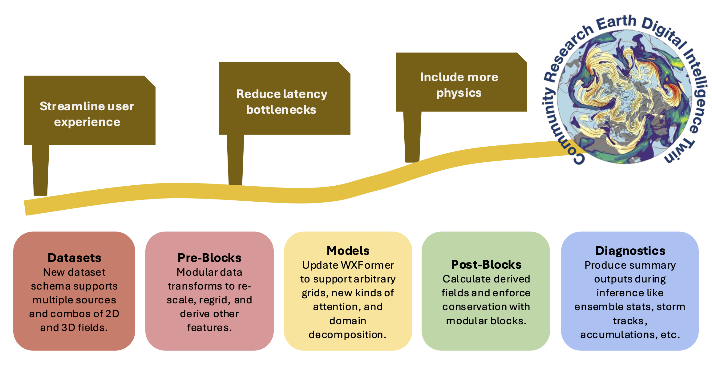

# CREDIT Gen 2 Overview

CREDIT Gen 2 addresses the need for an open, modular, composable framework to build ML Earth system prediction
models. CREDIT Gen 2 development has been guided by three key "signposts".

1. **Streamline user experience**: As a research tool, one of CREDIT's main goals is increasing speed to science.
We want users to be able to install the package and start running, training, and analyzing models within
minutes. We have added a CLI and restructured the config file to make interactions with CREDIT really straightforward.
2. **Reduce latency bottlenecks**: In our experience with CREDIT Gen 1, most of the compute time was being spent
loading data and performing pre- and post-processing operations. Therefore, we streamlined our datasets and converted
every pre-processing and post-processing step to PyTorch layers that can run on either CPU or GPU and are differentiable.
That means gradients can be calculated through physical transforms and time all the way to the initial conditions
in state space!
3. **Include more physics**: Even with the massive amount of data found in reanalyses and other model and observation 
datasets, many key processes and forcings are not explicitly represented, which results in the accumulation
of artifacts, oversmoothing, and improper coupling. We have made it much easier to include physics functions and
constraints at any point in the data and modeling pipeline. Not even the sky is the limit on what you could do with
this framework!

## Gen 1 vs Gen 2: which one am I using?

CREDIT currently ships two generations of the data/training pipeline side by
side. **Gen 2 is the current system and the right choice for all new work**;
Gen 1 is kept for reference and to reproduce published experiments (e.g. the
`config/gen_1/arXiv_2024/` configs). The pages in this documentation are
organized accordingly: everything under *Generation 2 Components* and the
quickstart describe Gen 2, while the *Generation 1* section at the bottom of
the sidebar covers the legacy pipeline.

The fastest way to tell which generation a config uses is the shape of its
`data:` block — Gen 2 nests sources under `data.source.<name>`, Gen 1 does not —
or its `trainer.type`:

|                       | Gen 1 (legacy)                       | Gen 2 (current)                                  |
|-----------------------|--------------------------------------|--------------------------------------------------|
| `trainer.type`        | `era5`                               | `gen2` / `era5-gen2`                             |
| Data schema           | flat `data:` block                   | nested `data.source.<name>` with typed channels (`prognostic` / `diagnostic` / `dynamic_forcing` / `static`) |
| `forecast_len`        | 0-indexed (`0` = single step)        | 1-indexed (`1` = single step)                    |
| Normalization         | pre-computed mean/std files          | `bridgescaler_transform` preblock fitted by `credit preprocess` |
| Pre/post-processing   | fixed transforms called internally   | composable `preblocks:` / `postblocks:` pipeline stages |
| Example configs       | `config/gen_1/`                      | `config/gen_2/examples/`                         |

An existing Gen 1 config can be migrated with `credit convert -c old.yml`,
which bumps `forecast_len` by 1, retargets `trainer.type`, and prompts for the
new settings.

## [Datasets](Datasets.md)
CREDIT Gen 2 has simplified the process for adding new Datasets and created
new Datasets for both local and cloud-based Datasets. We have also created
a new data schema that can support multiple data sources, 3D and 2D variables,
and a mix of prognostic, diagnostic, dynamic forcing, and static variables.

## [Preblocks](Preblocks.md)
CREDIT Gen 2 has added a new suite of Preblocks for pre-processing and 
transforming data prior to entering the emulator. Preblocks are written in
PyTorch to maximize processing speed and enable processing to happen on GPU
if needed. Preblocks are also differentiable to enable backprop through
time and for XAI in the input space.

## [Models](Models_gen2.md)
The WXFormer model sees some significant upgrades in Gen 2 with new settings and 
features that are designed to minimize artifacts and improve the sharpness of predictions.
All models can now be trained with PyTorch's updates to its distributed package, including
support for Fully Sharded Data Parallel v2 and sharded tensors for high resolution models. 
Your favorite models from Gen 1, including the original ERA5 WXFormers and CAMulator, also work
in Gen 2. Newer flagship models are now being designed and trained.

## [Postblocks](postblocks_gen2.md)
Postblocks in Gen 1 have been migrated to Gen 2, and new postblocks for diagnostic calculation
and pressure interpolation in PyTorch have been developed. With GPU parallelism, post-processing 
is no longer a major bottleneck for training or inference.

## [Interfaces](cli.md)
CREDIT now has an easily accessible command line interface to create config files and
access all major functionality of the platform. You can preprocess, train, and rollout models directly
or submit those jobs to the supercomputer with most of the configuration magic happening behind the scenes.

## [Custom Objects](Custom.md)
Want to use CREDIT with a dataset or model not currently supported? Want to make your own preblocks, 
postblocks, loss functions, or metrics? You can now register all of your own creations as custom
objects in CREDIT without having to modify the source code! See the [custom objects guide](Custom.md)
to learn how.

